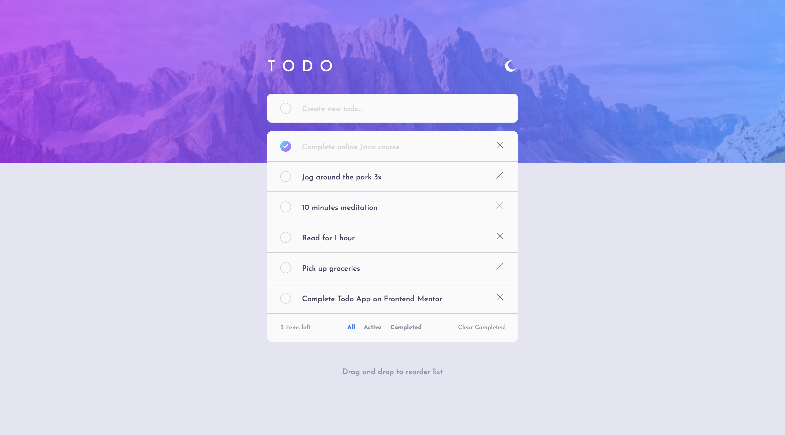

# Frontend Mentor - Todo app solution

This is a solution to the [Todo app challenge on Frontend Mentor](https://www.frontendmentor.io/challenges/todo-app-Su1_KokOW). Frontend Mentor challenges help you improve your coding skills by building realistic projects.

## Table of contents

- [Overview](#overview)
  - [The challenge](#the-challenge)
  - [Screenshot](#screenshot)
  - [Links](#links)
- [My process](#my-process)
  - [Built with](#built-with)
- [Author](#author)

## Overview

### The challenge

Users should be able to:

- View the optimal layout for the app depending on their device's screen size
- See hover states for all interactive elements on the page
- Add new todos to the list
- Mark todos as complete
- Delete todos from the list
- Filter by all/active/complete todos
- Clear all completed todos
- Toggle light and dark mode
- **Bonus**: Drag and drop to reorder items on the list

### Screenshot

### Links

- Solution URL: [https://github.com/battistar/todo-app-main](https://github.com/battistar/todo-app-main)
- Live Site URL: [https://battistar.github.io/todo-app-main/](https://battistar.github.io/todo-app-main/)

## My process

### Built with

- CSS custom properties
- Flexbox
- Mobile-first workflow
- [Styled Components](https://styled-components.com/) - For styles
- [React](https://reactjs.org/) - JS library
- [dnd kit](https://dndkit.com/) - Drag & drop toolkit

## Author

- Website - [Samuele Battistella](https://battistar.github.io/)
- Frontend Mentor - [@battistar](https://www.frontendmentor.io/profile/battistar)
